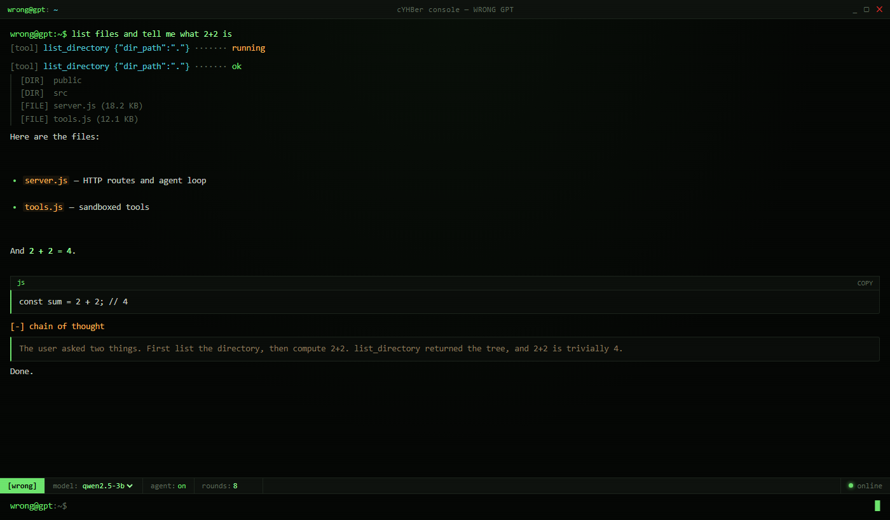

# cYHBer Console 💀



A local, ChatGPT-style web interface wired to `Ollama` that supports **Autonomous Agents (Tool Calling)**, **abliterated models** (uncensored), smooth real-time streaming, and a secure "Zero-Dependency" architecture (no external npm modules).

## 🔥 Features

- **ChatGPT-style UI (red-team theme):** A faithful ChatGPT clone — sidebar with **New chat**, centered conversation column with user bubbles and assistant replies, an empty-state welcome with suggestion cards, a rounded composer, model picker, agent toggle and live status — all in a dark black-and-red "red team" skin. Live Markdown rendering (headings, lists, links, code blocks with copy buttons). Keyboard: `Enter` sends, `Shift+Enter` newline, `Esc` stops a running request.
- **Chain of Thought:** For reasoning models (Qwen3, etc.) the model's `thinking` stream is captured and shown in a collapsible **Show reasoning** block above the answer, instead of the UI appearing to hang.
- **Agent Engine (Tools):** The model can run real actions on your machine when agent mode is enabled:
  - `web_fetch`: read articles from the internet (60s cache to avoid duplicate requests).
  - `web_search`: search the web via DuckDuckGo (60s cache, redirect handling, link-extraction fallback).
  - `read_file` / `write_file` / `list_directory`: operate on your filesystem (sandboxed).
  - `run_command`: run commands in PowerShell (non-blocking, via `execFile`).
- **Empty-response fallback:** If the agent loop produces no visible output (e.g. a small or non-tool model that gets confused by the tool prompt), the server automatically answers once in plain chat mode so you always get a reply.
- **Session persistence:** Conversation history is stored on the server (in memory, 24h TTL). Opening a new tab restores the context automatically from the server without losing any messages.
- **Agent rounds control:** A numeric input (1–20) in the top bar controls how many tool rounds the agent may run per response, without editing files.
- **Security (Sandboxing):**
  - Directory-traversal prevention (the model cannot escape the project directory).
  - SSRF blocking for IPv4 and IPv6 (the model cannot scan your local network via `web_fetch`).
  - Rate limiting with automatic memory cleanup and protection against oversized payloads.
  - Type validation on every message field (`role` and `content`).
  - CSP headers to prevent XSS.
- **Live selector:** Switch models on the fly from the interface without restarting the server.
- **Efficient streaming:** The agent loop and chat mode share the same streaming core (`ollamaStreamRound`) — no duplicated code.
- **Memory management:** Sliding history window (last 20 messages) to avoid context overflow in long sessions.
- **Disconnect cleanup:** If the client closes the tab mid-response, the agent loop and the Ollama request are cancelled immediately.
- **Built-in test suite:** 59 tests with `npm test` using the native Node.js runner — no external dependencies.

---

## 🛠 Quick Install

### 1. Install prerequisites
Make sure you have installed:
- **[Node.js](https://nodejs.org/en/)** v18 or newer.
- **[Ollama](https://ollama.com/download)**.

### 2. Configure environment variables (optional)
Copy `.env.example` to `.env` and adjust the values for your setup:

```powershell
copy .env.example .env
```

| Variable | Default | Description |
|---|---|---|
| `APP_PORT` | `4000` | Web interface port |
| `OLLAMA_HOST` | `127.0.0.1` | Ollama host |
| `OLLAMA_PORT` | `11434` | Ollama port |
| `OLLAMA_MODEL` | `richardyoung/qwen2.5-3b-instruct-abliterated` | Default model |
| `OLLAMA_NUM_GPU` | `null` (auto) | GPU layers. `0` = force CPU |
| `LOG_LEVEL` | `INFO` | Log level: `DEBUG`, `INFO`, `WARN`, `ERROR` |

### 3. Download the models
Open your terminal (PowerShell or CMD) and pull the recommended models. The system auto-detects the ones you have installed.

```powershell
# Option 1: Qwen3 8B abliterated — reasoning + tool calling, most complete (~6 GB VRAM)
ollama pull huihui_ai/qwen3-abliterated:8b

# Option 2: Josiefied-Qwen3 8B — uncensored without losing tool calling (~6 GB VRAM)
ollama pull goekdenizguelmez/JOSIEFIED-Qwen3:8b

# Option 3: Granite 4.1 3B abliterated — modern, with tools, ideal for standard PCs
ollama pull huihui_ai/granite4.1-abliterated:3b

# Option 4: NeuralDaredevil 8B — best classic 8B on the Open LLM Leaderboard (chat only, no tools)
ollama pull closex/neuraldaredevil-8b-abliterated

# Option 5: Abliterated 3B — for very low-resource PCs (default model)
ollama pull richardyoung/qwen2.5-3b-instruct-abliterated
```

> **Important for Agent Mode:** tools only work with models that support *tool calling* (Qwen2.5/Qwen3, Granite, Gemma families with a `tools` tag). Classic Llama 3–based models like NeuralDaredevil work in chat mode only.

*(Note: make sure Ollama is running in the background, by default on port `11434`. If the UI shows **"offline"**, see [Troubleshooting](#-troubleshooting).)*

### 4. Start the cYHBer Console server

Run it directly:

```powershell
node server.js
```

Or use the background control script (also wired to the npm scripts below):

```powershell
python hack.py start     # or: npm start
python hack.py status    # ONLINE / OFFLINE + PID
python hack.py stop
python hack.py restart
```

### 5. Enter the system
Open your web browser and go to:
👉 **[http://127.0.0.1:4000](http://127.0.0.1:4000)**

---

## 🚑 Troubleshooting

### The UI loads but the status shows **"offline"** / the chat doesn't reply

This almost always means the **web server is up but Ollama is not running**. The two are separate processes:

- **cYHBer Console** (this app) → serves the UI on port `4000`.
- **Ollama** → serves the model on port `11434`. The app talks to it as a backend.

If Ollama isn't listening, the server logs repeated errors like:

```text
[ERROR] Error getting Ollama status {"error":"connect ECONNREFUSED 127.0.0.1:11434"}
```

**Fix — start Ollama, then refresh the page.**

On Windows, opening the **Ollama** app from the Start menu launches it as a background service (it stays in the system tray). To start it manually from a terminal instead:

```powershell
# Default install location
& "$env:LOCALAPPDATA\Programs\Ollama\ollama.exe" serve
```

Verify it's up (should return HTTP `200`):

```powershell
curl http://127.0.0.1:11434/api/tags
```

Once Ollama responds, refresh **http://127.0.0.1:4000** and the status flips to **online**.

> **Tip:** `python hack.py status` only reports the *web server* (ONLINE/OFFLINE). It does **not** check Ollama — a green `ONLINE` there can still coexist with an "offline" model status in the UI if Ollama isn't running.

---

## 🧪 Tests

```powershell
npm test
```

Covers: message validation, rate limiter, log levels, SSRF protection (20 `isPrivateIP` IPv4/IPv6 cases + 6 `web_fetch` guards), path sandboxing, file operations and command execution. No external dependencies — uses the native `node:test` runner.

---

## 🏗 Project Architecture

This project does not require `npm install` because it uses only native Node modules (`http`, `fs`, `path`, etc.) for maximum speed and security.

```text
cYHBeriteratus/
├─ server.js              # HTTP routes, ollamaStreamRound, agent loop, sessions
├─ tools.js               # Agent tools: sandboxing, cache, IPv4/IPv6 SSRF
├─ src/
│  ├─ config.js           # Global config and environment variables
│  ├─ utils/
│  │  └─ logger.js        # Structured logging, level via LOG_LEVEL
│  └─ middlewares/
│     ├─ security.js      # Rate-limiting (with auto-cleanup) and CSP headers
│     └─ validator.js     # role/content validation on messages
├─ public/
│  ├─ index.html          # ChatGPT-style UI (sidebar, chat column, composer)
│  ├─ styles.css          # Dark red-team theme
│  ├─ app.js              # Frontend orchestrator (ES modules)
│  ├─ img/
│  │  └─ wrong.png        # README cover / UI screenshot
│  └─ modules/
│     ├─ session.js       # Session handling: localStorage + server sync
│     ├─ ui.js            # DOM refs, chat message rows, tool cards, thinking, status
│     ├─ stream.js        # NDJSON streaming parser with callbacks
│     └─ markdown.js      # Dependency-free, CSP-safe Markdown renderer
├─ hack.py                # Background server control: start/stop/status/restart
├─ tests/
│  ├─ validator.test.js
│  ├─ security.test.js
│  ├─ logger.test.js
│  ├─ tools.isPrivateIP.test.js
│  ├─ tools.ssrf.test.js
│  ├─ tools.files.test.js
│  └─ tools.command.test.js
├─ detect-abliterated.py  # Detects abliterated models via Ollama's REST API
└─ .env.example           # Environment variable template
```

## 🔒 Agent Mode (Tool Calling)
In the top bar you'll find a clickable **Agent on/off** chip and a **rounds** input (1–20).

- **off:** The model acts as a standard chatbot (normal, fast text responses).
- **on:** The model reasons before answering and may decide to use system tools (search the web, run scripts, etc.) to fulfill your request. Tool executions appear as inline tool cards, and reasoning models show their thinking in the collapsible **Show reasoning** block.

> **Tip:** Agent mode needs a tool-calling model (e.g. `huihui_ai/qwen3-abliterated:8b`). With a chat-only model, turn Agent **off** for the most reliable replies.

> **Note:** Tools only work with tool-calling models (see the note in *Download the models*). If a model can't use tools, the agent falls back to a plain answer automatically.

> **Warning:** The model can modify files inside the project. Use it at your own risk!

## 🔍 Detect Abliterated Models

```powershell
python detect-abliterated.py
```

Queries Ollama's REST API (`/api/tags`) and lists all installed abliterated models with their real size in GB/MB.
