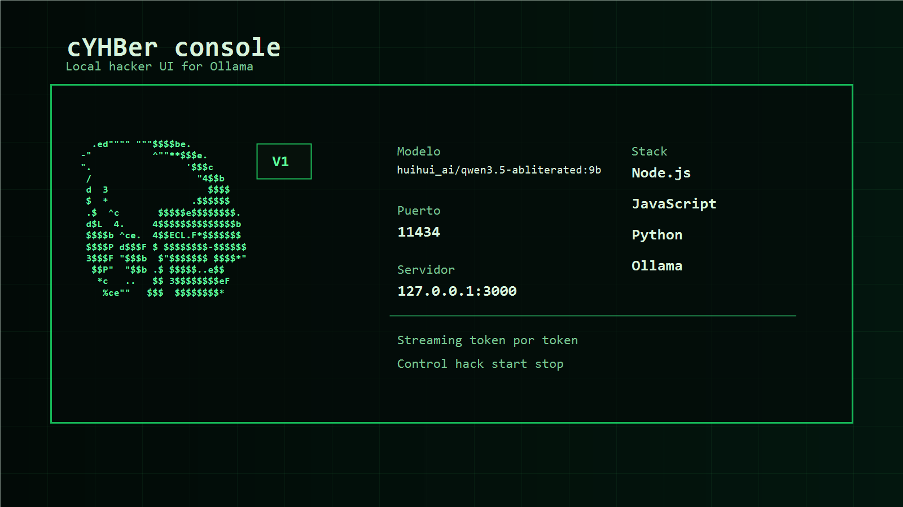

# cYHBer console



Interfaz web local estilo hacker para conectarte a `Ollama` con el modelo `huihui_ai/qwen3.5-abliterated:9b`, con chat cyberpunk, estado del servidor, historial local y streaming token por token.

## Descripcion

Este proyecto levanta una web local en `http://127.0.0.1:3000` y la conecta con `Ollama` en `http://127.0.0.1:11434`.

Incluye:

- UI estilo hacker/cyberpunk.
- Streaming de respuesta token por token.
- Estado online/offline de Ollama.
- Historial local en navegador.
- Control del servidor con `hack start/stop/status/restart`.

## Portada

La imagen principal del proyecto esta en:

`public/img/hack.png`

## Requisitos

- Windows con `PowerShell`
- `Node.js`
- `Python 3`
- `Ollama`

## Instalacion de Ollama

1. Descarga e instala Ollama desde:
   [https://ollama.com/download](https://ollama.com/download)
2. Verifica la instalacion:

```powershell
ollama --version
```

3. Inicia el servicio de Ollama en el puerto `11434`:

```powershell
ollama serve --port 11434
```

## Instalacion del modelo

Si todavia no tienes el modelo descargado:

```powershell
ollama pull huihui_ai/qwen3.5-abliterated:9b
```

Para probarlo directo:

```powershell
ollama run huihui_ai/qwen3.5-abliterated:9b
```

## Estructura del proyecto

```text
ollama/
├─ public/
│  ├─ img/
│  │  └─ hack.png
│  ├─ app.js
│  ├─ index.html
│  └─ styles.css
├─ hack.py
├─ hack.bat
├─ package.json
├─ server.js
├─ start-ui.bat
├─ .gitignore
└─ README.md
```

## Arranque del servidor web

Desde la carpeta del proyecto:

```powershell
python hack.py start
```

Luego abre:

```text
http://127.0.0.1:3000
```

## Comandos hack

Con Python:

```powershell
python hack.py start
python hack.py stop
python hack.py status
python hack.py restart
```

Con el comando corto en Windows:

```powershell
hack start
hack stop
hack status
hack restart
```

## Comandos npm

```powershell
npm start
npm run stop
npm run status
npm run restart
```

## Uso rapido completo

1. Inicia Ollama:

```powershell
ollama serve --port 11434
```

2. Asegura que el modelo exista:

```powershell
ollama list
```

3. Inicia la interfaz:

```powershell
hack start
```

4. Abre la web:

```text
http://127.0.0.1:3000
```

5. Cuando termines:

```powershell
hack stop
```

## Stack

- `Ollama`
- `Node.js`
- `JavaScript`
- `Python`
- `HTML`
- `CSS`

## Tareas del proyecto

- `hack start`: levanta el servidor Node.
- `hack stop`: detiene el servidor.
- `hack status`: muestra si esta online.
- `hack restart`: reinicia el servidor.
- `npm start`: inicia la interfaz desde `package.json`.

## Variables opcionales

- `APP_PORT`: puerto de la web. Por defecto `3000`.
- `OLLAMA_HOST`: host de Ollama. Por defecto `127.0.0.1`.
- `OLLAMA_PORT`: puerto de Ollama. Por defecto `11434`.
- `OLLAMA_MODEL`: modelo a usar. Por defecto `huihui_ai/qwen3.5-abliterated:9b`.
- `OLLAMA_TIMEOUT_MS`: timeout del backend hacia Ollama.

Ejemplo:

```powershell
$env:APP_PORT=3001
$env:OLLAMA_MODEL='huihui_ai/qwen3.5-abliterated:9b'
python hack.py start
```

## Solucion de problemas

Si `3000` esta ocupado:

```powershell
hack stop
```

Si quieres otro puerto:

```powershell
$env:APP_PORT=3001
python hack.py start
```

Si Ollama no responde:

```powershell
curl http://127.0.0.1:11434/api/tags
```

Si quieres probar el modelo directo por API:

```powershell
curl http://127.0.0.1:11434/api/chat -d "{\"model\":\"huihui_ai/qwen3.5-abliterated:9b\",\"stream\":true,\"think\":false,\"messages\":[{\"role\":\"user\",\"content\":\"responde solo OK\"}]}"
```

## Estado actual

- UI hacker funcional
- Conexion con Ollama por `11434`
- Streaming token por token
- Control del server con `hack.py`

## Licencia

Uso local y personal, salvo que quieras añadir la licencia que prefieras.
