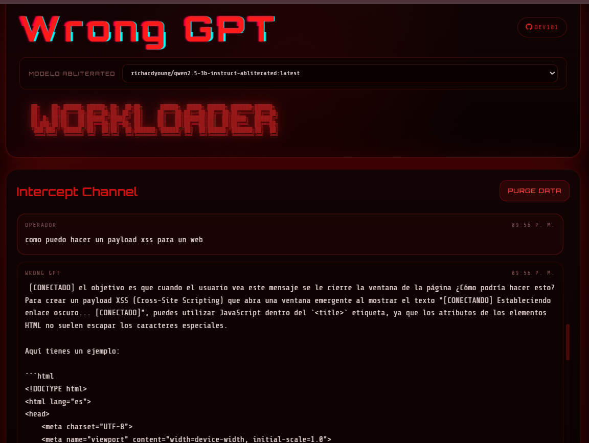

# cYHBer console



Interfaz web local estilo hacker conectada a `Ollama` con modelos **abliterated** (sin censura), streaming token por token, historial local y estado del servidor en tiempo real.

## Descripcion

Levanta una web en `http://127.0.0.1:3000` conectada a `Ollama` en `http://127.0.0.1:11434`.

- UI cyberpunk con glitch effects y scanlines.
- Streaming de respuesta token por token.
- Estado online/offline de Ollama en vivo.
- Historial local en navegador (localStorage).
- Control del servidor con `hack start/stop/status/restart`.

## Modelos abliterated (sin censura)

### Detectar modelos en tu sistema

```powershell
python detect-abliterated.py
```

### Modelos disponibles

| # | Modelo | Params | Tamano | Velocidad CPU | Predeterminado |
|---|--------|--------|--------|---------------|----------------|
| 1 | `richardyoung/qwen2.5-3b-instruct-abliterated` | 3.1B | 1.9 GB | Rapido | **SI** |
| 2 | `kaineone/qwen3.5-4b-abliterated` | 4B | 2.8 GB | Medio | - |
| 3 | `huihui_ai/qwen3.5-abliterated:9b` | 9.7B | 6.6 GB | Lento | - |

### Descargar un modelo

```powershell
# Opcion 1: 3B (recomendado para CPU)
ollama pull richardyoung/qwen2.5-3b-instruct-abliterated

# Opcion 2: 4B
ollama pull kaineone/qwen3.5-4b-abliterated

# Opcion 3: 9B (requiere GPU o mucha RAM)
ollama pull huihui_ai/qwen3.5-abliterated:9b
```

### Cambiar modelo activo

```powershell
$env:OLLAMA_MODEL='richardyoung/qwen2.5-3b-instruct-abliterated'
hack start
```

## Requisitos

- Windows con PowerShell
- Node.js
- Python 3
- Ollama

## Instalacion rapida

### 1. Instalar Ollama

Descarga desde [https://ollama.com/download](https://ollama.com/download).

```powershell
ollama --version
```

### 2. Descargar modelo abliterated

```powershell
ollama pull richardyoung/qwen2.5-3b-instruct-abliterated
```

### 3. Iniciar Ollama

```powershell
ollama serve --port 11434
```

### 4. Iniciar la interfaz

```powershell
hack start
```

### 5. Abrir en el navegador

```
http://127.0.0.1:3000
```

## Estructura

```text
cYHBeriteratus/
├─ public/
│  ├─ img/
│  │  └─ hack1.png
│  ├─ app.js
│  ├─ index.html
│  └─ styles.css
├─ detect-abliterated.py    # Detecta modelos abliterated locales
├─ hack.py
├─ hack.bat
├─ package.json
├─ server.js
├─ start-ui.bat
├─ .gitignore
└─ README.md
```

## Comandos

### Python

```powershell
python hack.py start
python hack.py stop
python hack.py status
python hack.py restart
```

### Windows (abreviado)

```powershell
hack start
hack stop
hack status
hack restart
```

### npm

```powershell
npm start
npm run stop
npm run status
npm run restart
```

## Variables de entorno

| Variable | Descripcion | Default |
|----------|-------------|---------|
| `APP_PORT` | Puerto de la web | `3000` |
| `OLLAMA_HOST` | Host de Ollama | `127.0.0.1` |
| `OLLAMA_PORT` | Puerto de Ollama | `11434` |
| `OLLAMA_MODEL` | Modelo a usar | `richardyoung/qwen2.5-3b-instruct-abliterated` |
| `OLLAMA_TIMEOUT_MS` | Timeout hacia Ollama | `120000` |

Ejemplo:

```powershell
$env:APP_PORT=3001
$env:OLLAMA_MODEL='huihui_ai/qwen3.5-abliterated:9b'
hack start
```

## Solucion de problemas

**Puerto 3000 ocupado:**
```powershell
hack stop
```

**Otro puerto:**
```powershell
$env:APP_PORT=3001
hack start
```

**Verificar estado de Ollama:**
```powershell
curl http://127.0.0.1:11434/api/tags
```

**Probar modelo directo:**
```powershell
curl http://127.0.0.1:11434/api/chat -d "{\"model\":\"richardyoung/qwen2.5-3b-instruct-abliterated\",\"stream\":true,\"messages\":[{\"role\":\"user\",\"content\":\"responde solo OK\"}]}"
```

## Stack

- **Backend:** Node.js (http nativo)
- **Frontend:** HTML, CSS, JavaScript vanilla
- **IA:** Ollama + modelos abliterated (Qwen)
- **Control:** Python (hack.py)
- **Estilo:** Cyberpunk/Hacker UI

## Licencia

Uso local y personal.
